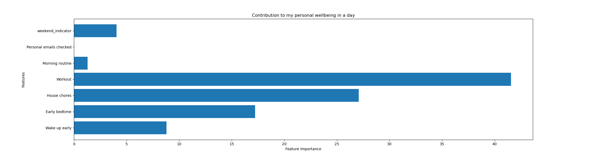

# Feature importance analysis on habits contribution to daily wellbeing

## 📌 Actions
Based on the feature importance score of my models I made the following changes:  
    1. Signed up for gym membership  
    2. Chores of the week are not done adhocly but are part of the weekly plan  
    3. Early bed time alarm was set up  